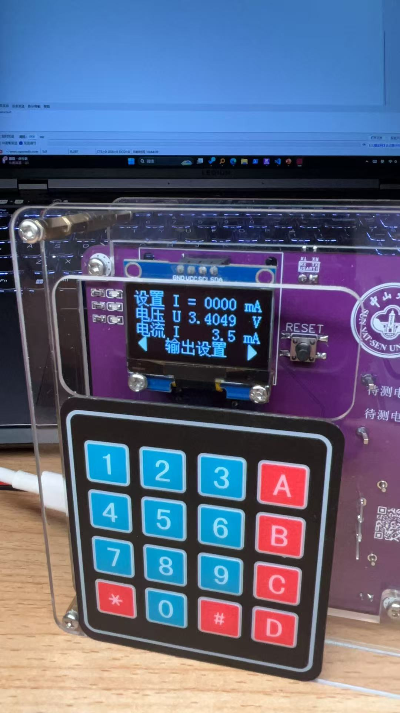
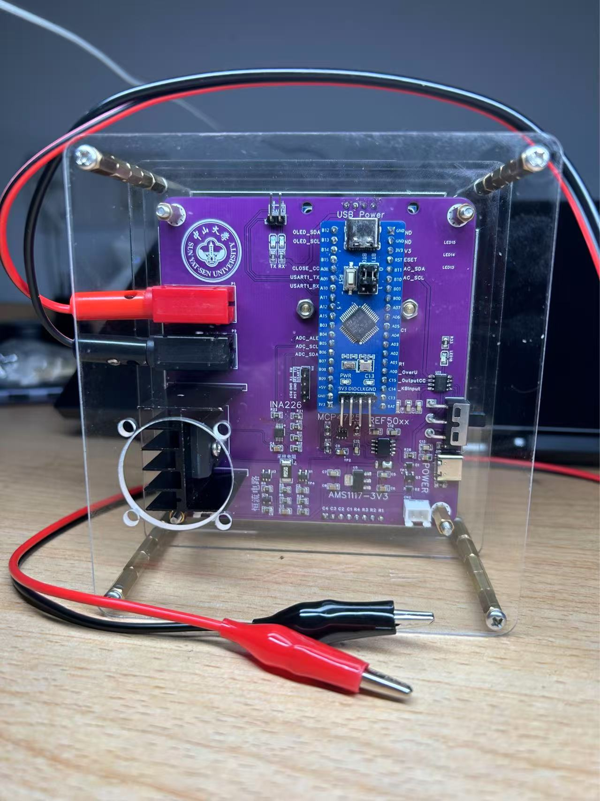

# STM32 高精度直流电子负载

## 📖 项目简介 (Introduction)

本项目是一款基于 STM32F103 微控制器的简易高精度恒流直流电子负载。设计旨在提供一个低成本、高线性度的电源测试工具，主要用于测试直流稳压电源、电池组及光伏电池板的负载特性。

系统采用“数字设定、模拟闭环”的混合控制架构，结合 OPA376 精密运放与 INA226 功率监测芯片，在实现 100mA - 1000mA 恒流控制的同时，保证优于 ±1% 的设定精度和极高的动态响应能力。




### 主要特性

- 恒流模式 (CC Mode)：支持 100-1000mA 连续可调。
- 高精度测量：集成 INA226，提供 16-bit 分辨率的电压电流回读。
- 高稳定性：使用 REF5040 提供 4.096V 精密基准，温漂极低。
- 安全保护：硬件级过压保护 (OVP)，阈值 18V。
- 自动化测试：内置负载调整率自动扫描功能。

## ⚙️ 核心功能与指标 (Specifications)

| 参数             | 指标                | 备注                   |
|------------------|---------------------|------------------------|
| 主控芯片         | STM32F103C8T6       | ARM Cortex-M3          |
| 输入电压范围     | 0 - 18.0V           | 超过 18V 触发 OVP 保护 |
| 恒流控制范围     | 100 mA - 1000 mA    | 步进 10 mA             |
| 设定精度         | ±1%                 | 经软件校准后           |
| 电流回读分辨率   | 1 mA                | INA226 采样            |
| 电压回读分辨率   | 1 mV                | INA226 采样            |
| 动态稳定性       | 0.25% @ 10V Step    | 电压突变 10V 时电流波动率 |
| 通信接口         | USB Type-C (UART)   | CH340N 转串口          |

## 🛠️ 硬件架构 (Hardware Architecture)

本项目硬件部分采用模块化设计，主要由以下核心器件构成：

### 关键元器件清单 (BOM)

| 组件          | 型号           | 作用         | 技术优势                       |
|---------------|----------------|--------------|--------------------------------|
| MCU           | STM32F103C8T6  | 系统主控     | 丰富的外设与成熟的生态         |
| Power Monitor | INA226         | 电压电流采集 | 16-bit ADC, I2C 接口, 极低 Offset |
| DAC           | MCP4725        | 基准电压生成 | 12-bit 分辨率, I2C 接口, 自带 EEPROM |
| Op-Amp        | OPA376         | 误差放大器   | 25µV 低失调电压, 5.5MHz 带宽, 轨对轨输出 |
| V-Ref         | REF5040        | 电压基准源   | 4.096V 输出, 3ppm/°C 低温漂           |
| MOSFET        | IRFP260N       | 功率耗散管   | 50A/200V, TO-247 封装, 适合线性区工作 |
| Display       | 1.3" OLED      | 人机交互     | SH1106 驱动, I2C 接口                |

### 模拟控制环路

系统核心为模拟负反馈环路。DAC (MCP4725) 输出控制电压连接至运放 (OPA376) 同相端，运放输出驱动 MOSFET 栅极。检流电阻 (50mΩ) 两端的电压反馈至运放反相端，形成闭环控制，确保流经负载的电流严格跟随 DAC 设定值，不受输入电压波动影响。

## 💻 软件说明 (Software)

固件基于 STM32 标准外设库 (SPL) 开发。

### 目录结构

```text
Hardware/
    ELoad.c           # 电子负载核心函数
    ELoad_config.h    # 常量配置
    Component/
        INA226.c          # INA226 驱动（I2C）
        MCP4725.c         # MCP4725 DAC 驱动（I2C）
        OLED.c            # 屏幕驱动（SH1106）
        Key.c             # 矩阵键盘扫描
    Periph/
        LED.c             # 指示灯
        OverU.c           # 过压保护
        Serial.c          # 串口通信与命令解析
Library/
    (STM32 标准库)
User/
    main.c            # 主程序逻辑
    stm32f10x_it.c    # 中断服务函数
ELoad_<version>.hex   # 可直接烧录的 HEX 文件
```

### 校准算法

为消除硬件公差（如电阻误差、运放失调），软件集成了线性回归校准算法：

- 电流校准：`I_corrected = k1 * I_read + b1`
- DAC 输出校准：`DAC_code = k2 * I_set + b2`

校准参数需通过实测数据拟合并写入固件或 EEPROM。

## 🚀 快速上手（Getting Started）

1. **硬件准备**
    - 按照原理图完成 PCB 焊接与元器件安装。
    - 注意散热：为 IRFP260N 安装合适的散热片与风扇，确保结温安全。
    - 供电：通过 USB Type-C 提供调试/控制电源（根据设计还需外部电源）。

2. **编译与烧录**
    - 使用 Keil uVision 5（或其他支持的 IDE）打开工程并编译。
    - 使用 ST-Link / J-Link 烧录固件到 STM32。
3. **操作说明**
    - 键盘控制：
        - `0-9` 输入电流设定值（单位 mA）。
        - `#` 确认设定并启动测试。
        - `A` 开/关 恒流输出（ON/OFF）。
        - `B` 进入自动测试模式。
        - `C/D` 菜单翻页或光标移动。

    - 串口控制（115200，8N1）：

        ```text
        set current 500     # 设定恒流为 500 mA
        autotest            # 启动自动扫描测试
        get status          # 获取当前电压、电流状态
        ```

## 📊 性能验证

- 设定精度：全量程实测误差约 0.22%。
- 阶跃响应：输入电压从 5 V 跳变至 15 V 时，电流波动约 1 mA（约 0.25%），显示出良好的模拟环路抑制能力。

## 🤝 贡献与反馈

欢迎提交 Issue 或 Pull Request 来改进本项目。

## 📝 待办（TODO）

- [ ] 增加四线制（Kelvin）电压测量支持
- [ ] 优化 PID 温控风扇策略
- [ ] 开发上位机波形显示软件

## 📄 许可证（License）

本项目采用 MIT 许可证。详情见 `LICENSE` 文件。

## ⚠️ 免责声明

本项目仅用于教育和工程参考，请在处理大功率负载时注意散热与安全措施。
